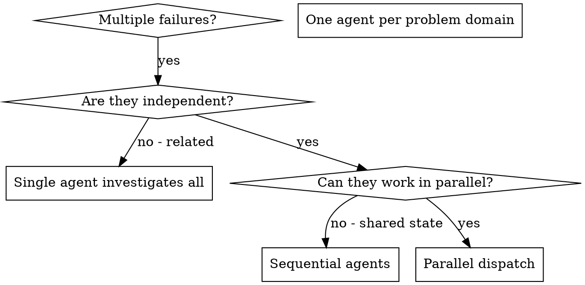

# Dispatching Parallel Agents

## Overview

When you have multiple unrelated failures (different test files, different subsystems, different bugs), investigating them sequentially wastes time. Each investigation is independent and can happen in parallel.

**Core principle:** Dispatch one agent per independent problem domain. Let them work concurrently.

## When to Use



**Use when:**
- 3+ test files failing with different root causes
- Multiple subsystems broken independently
- Each problem can be understood without context from others
- No shared state between investigations

**Don't use when:**
- Failures are related (fix one might fix others)
- Need to understand full system state
- Agents would interfere with each other

## The Pattern

### 1. Identify Independent Domains
Group failures by what's broken (e.g., File A: tool approval flow, File B: batch completion, File C: abort functionality). Each domain is independent - fixing one doesn't affect the others.

### 2. Create Focused Agent Tasks
Each agent gets: **specific scope** (one test file/subsystem), **clear goal** (make these tests pass), **constraints** (don't change other code), **expected output** (summary of findings and fixes).

### 3. Dispatch in Parallel
```typescript
Task("Fix agent-tool-abort.test.ts failures")
Task("Fix batch-completion-behavior.test.ts failures")
Task("Fix tool-approval-race-conditions.test.ts failures")
// All three run concurrently
```

### 4. Review and Integrate
Read each summary, verify fixes don't conflict, run full test suite, integrate all changes.

## Agent Prompt Structure

Three rules for good agent prompts:
1. **Focused** - One clear problem domain
2. **Self-contained** - All context needed to understand the problem
3. **Specific about output** - What should the agent return?

**Condensed example:**
```markdown
Fix the 3 failing tests in src/agents/agent-tool-abort.test.ts:
1. "should abort tool with partial output capture" - expects 'interrupted at'
2. "should handle mixed completed and aborted tools" - fast tool aborted
3. "should properly track pendingToolCount" - expects 3 results, gets 0

These are timing/race condition issues. Replace arbitrary timeouts with
event-based waiting. Do NOT just increase timeouts.
Return: Summary of root cause and changes made.
```

See `references/agent-prompt-example.md` for full annotated version.

## Common Mistakes

**Too broad:** "Fix all the tests" - agent gets lost
**Specific:** "Fix agent-tool-abort.test.ts" - focused scope

**No context:** "Fix the race condition" - agent doesn't know where
**Context:** Paste the error messages and test names

**No constraints:** Agent might refactor everything
**Constraints:** "Do NOT change production code" or "Fix tests only"

**Vague output:** "Fix it" - you don't know what changed
**Specific:** "Return summary of root cause and changes"

## When NOT to Use

- **Related failures:** Fixing one might fix others - investigate together first
- **Need full context:** Understanding requires seeing entire system
- **Exploratory debugging:** You don't know what's broken yet
- **Shared state:** Agents would interfere (editing same files, using same resources)

## Verification

After agents return:
1. **Review each summary** - Understand what changed
2. **Check for conflicts** - Did agents edit same code?
3. **Run full suite** - Verify all fixes work together
4. **Spot check** - Agents can make systematic errors

## Reference Files

| File | When to read |
|------|-------------|
| `references/agent-prompt-example.md` | Full annotated prompt example with test names and constraints |
| `references/real-session-example.md` | Complete scenario: dispatch, results, integration, time saved |
| `references/real-world-impact.md` | Stats from debugging session (2025-10-03) |
