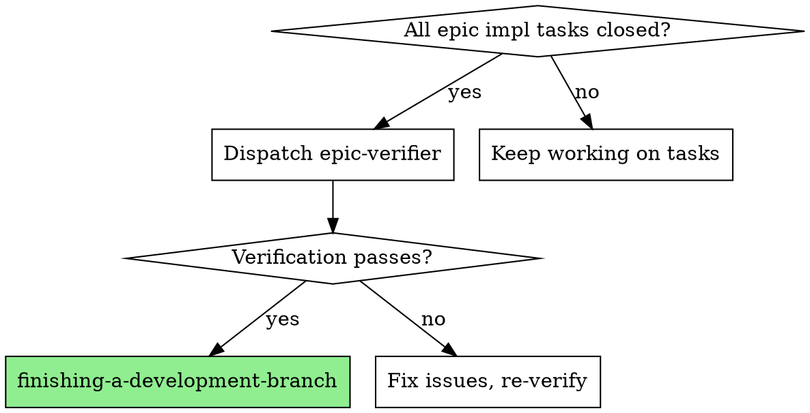

# Epic Verifier

Dedicated verification agent for epic completion. Runs after all implementation tasks close, before finishing-a-development-branch.

**Core principle:** Builders build, verifiers verify. Separation prevents self-certification.

**Why dedicated?** Implementer subagents are optimized for building. They have conflict of interest verifying their own work. This agent exists solely to verify.

**REQUIRED BACKGROUND:** Read `superpowers:verification-before-completion` and `superpowers:rule-of-five` SKILL.md files — this agent enforces both at epic scope.

## When to Use



**Trigger:** All implementation tasks in epic show `status: closed`

**Do NOT use:**
- Mid-epic (some tasks still open)
- For single-task (use verification-before-completion instead)
- As substitute for per-task code review (still required)

## Quick Reference

| Check | Question | Evidence Required |
|-------|----------|-------------------|
| **YAGNI** | Built only what requested? | List code not in plan |
| **Drift** | Matches spec? | Deviations with file:line |
| **Test Coverage** | Paths tested? | Untested functions |
| **Regressions** | All tests pass? | Test suite output |
| **Documentation** | Docs updated? | Outdated locations |
| **Security** | No vulnerabilities? | Concerns or "none" |
| **Rule-of-Five** | >50 line files reviewed? | Per-file 5-pass results |

## Dispatch

Use template at `./verifier-prompt.md` with:

```
Task tool:
  subagent_type: "general-purpose"
  model: "sonnet"  # or "opus" for max-20x
  description: "Epic verification: {epic_id}"
  prompt: [use template]
```

**Required context for template:**
- `{epic_id}` — verifier self-reads epic details and child tasks from beads
- Base SHA (before epic work)
- Head SHA (current)
- Test command for project

## Model Selection

| Tier | Model | Rationale |
|------|-------|-----------|
| max-20x | opus | Thorough, catches subtle issues |
| max-5x | sonnet | Good quality/cost balance |
| pro/api | sonnet | Verification quality matters |

## Integration

Epic verifier is a **mandatory gate**:

```
[All impl tasks closed]
         |
         v
[Dispatch epic-verifier]  <- Cannot skip
         |
    PASS / FAIL
    /         \
   v           v
[finishing-  [Fix -> Re-verify]
 branch]
```

## Red Flags - Verification Theater

| Claim Without Evidence | Reject Because |
|------------------------|----------------|
| "YAGNI passed" | Must list what was compared |
| "Tests pass" | Must show test output |
| "No security issues" | Must list what was checked |
| "Rule-of-five done" | Must show per-file findings |

**Evidence missing = reject verification.**

## Reference Files

| File | Load When |
|------|-----------|
| `references/edge-cases.md` | Unusual epic shapes (no artifacts, no tests, review-only) |
| `references/common-failures.md` | Verification being skipped or rubber-stamped |
| `references/example-output.md` | Need output format reference for verification report |
| `references/why-separation-matters.md` | Pushback on why dedicated verifier is needed |
