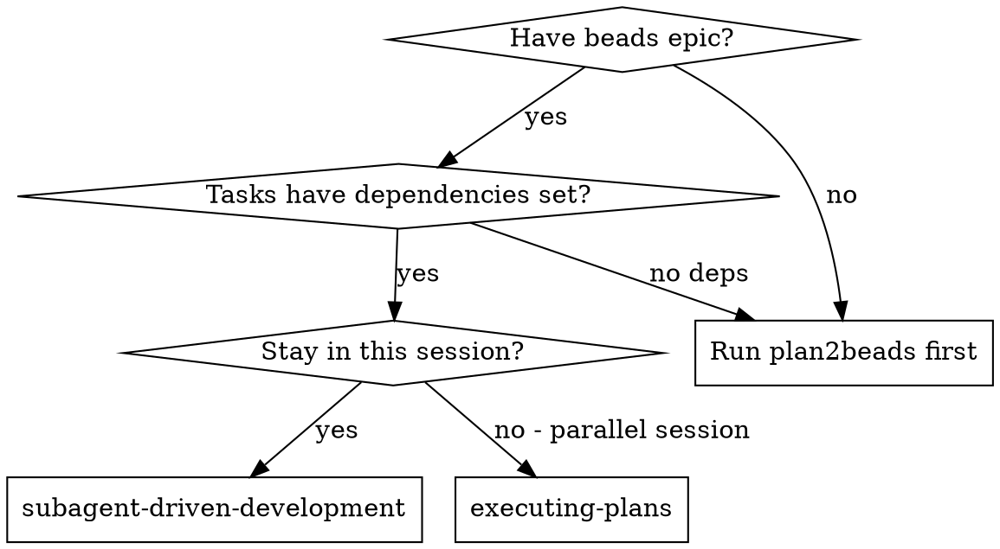
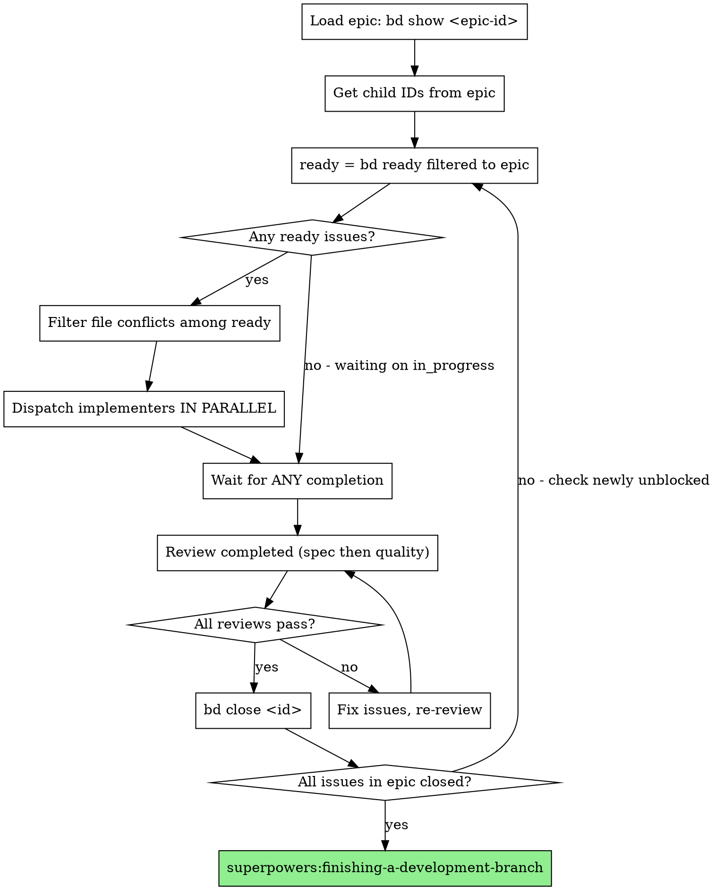

# Subagent-Driven Development

Execute beads epic by dispatching parallel subagents for independent issues, with two-stage review after each completion.

**Core principle:** Parallel dispatch of independent tasks + dependency awareness + two-stage review = high quality, maximum throughput

**REQUIRED BACKGROUND:** You MUST understand `superpowers:beads` before using this skill. That skill covers bd CLI usage, permission avoidance, and dependency management.

## When to Use



**Announce at start:** "I'm using Subagent-Driven Development to execute beads epic [epic-id]."

## Budget Tier Selection

Before dispatching, determine model selection strategy.

**Ask the user:**
> What's your Claude Code subscription tier?
> - **Max 20x** - Quality priority (opus for implementation)
> - **Max 5x** - Balanced (sonnet throughout)
> - **Pro/API** - Budget priority (haiku where possible)

**Model matrix by tier:**

| Tier | Implementer | Spec Reviewer | Code Reviewer | Epic Verifier |
|------|-------------|---------------|---------------|---------------|
| max-20x | opus | sonnet | sonnet | opus |
| max-5x | sonnet | haiku | sonnet | sonnet |
| pro/api | sonnet | haiku | haiku | sonnet |

Note: Epic Verifier uses sonnet minimum (opus for max-20x) because verification is comprehensive and must catch subtle issues. See `skills/epic-verifier/SKILL.md`.

**Store selection** for the session - don't ask again per wave.

## Context Loading

Before dispatching implementers, load rich context to help them understand "why":

### Epic Context

Extract from epic description:

```bash
# Get epic details
bd show <epic-id>

# Parse Key Decisions section (between "Key Decisions:" and next heading or "---")
# Include epic goal (first paragraph of description)
```

**What to extract:**
- Epic goal (first sentence/paragraph)
- Key Decisions (3-5 decisions with rationale)
- Task purpose (from task's description or infer from title)

**Template slots to fill:**
- `[EPIC_GOAL]` - One sentence epic goal
- `[KEY_DECISIONS]` - Bullet list of decisions, or "None documented - refer to epic description"
- `[TASK_PURPOSE]` - Why this task matters

**Edge case:** If epic description lacks "Key Decisions:" section, use "Key Decisions not documented. Refer to epic description for context."

### Wave Conventions

Extract from epic comments:

```bash
# Get wave summary comments
bd comments list <epic-id> --format json | jq -r '
  .[] | select(.text | contains("Wave")) | .text
' | tail -3
```

**What to extract:**
- Naming conventions chosen
- Code patterns established
- Interface shapes implemented
- Any surprises or deviations

**Template slot to fill:**
- `[WAVE_CONVENTIONS]` - Bullet list or "None yet (first wave)"

**Prerequisites:**
- Beads epic exists (created via plan2beads)
- Dependencies are set (`bd blocked` shows expected blockers)
- Each issue has `## Files` section in description
- Epic has 2+ child issues (single-issue work doesn't need orchestration—just implement and use `superpowers:verification-before-completion`)

## Key Terms

| Term | Meaning |
|------|---------|
| **Dispatch** | Use the `Task` tool to spawn a subagent with a specific prompt |
| **Wave** | A batch of issues dispatched together (all have no dependency conflicts) |
| **bd** | Beads CLI - git-backed issue tracker (`bd ready`, `bd show`, `bd close`, etc.) |
| **Ready** | Issue has no blockers - all its dependencies are closed |
| **Blocked** | Issue is waiting for one or more dependencies to close |

## The Process



## Verification Tasks

Verification tasks (like Rule-of-Five, Code Review, Plan Verification) are processed through the **same dispatch loop** as implementation tasks, but are routed to specialized agents based on task type (see "Dispatch Decision" section below).

**Key points:**

1. **Appear in `bd ready`** - When an implementation task closes, its dependent verification task becomes ready
2. **Routed by title** - Tasks with "verification" or "verify" in title use the verifier prompt template, others use the implementer prompt
3. **Same review flow** - All tasks still go through spec compliance then code quality review
4. **Specific acceptance criteria** - The spec reviewer verifies the verification was actually performed, not just claimed

**Example: Rule-of-Five verification task**

```
Task superpowers-xyz.5 (Rule-of-Five verification)
  Dependencies: [superpowers-xyz.1, superpowers-xyz.2, superpowers-xyz.3, superpowers-xyz.4]
  Files: [docs/plans/implementation-plan.md]
  Acceptance: Apply 5-pass review to all artifacts >50 lines created in tasks 1-4
```

**Dispatch flow:**
```
[Tasks 1-4 all closed]
[bd ready now shows superpowers-xyz.5]

[bd update superpowers-xyz.5 --status=in_progress]
[Dispatch implementer for superpowers-xyz.5]

Implementer:
  - Reviews artifacts from tasks 1-4
  - Applies Rule-of-Five passes
  - Documents changes made in each pass
  - Committed

[Dispatch spec reviewer]
Spec reviewer:
  - Verifies each required artifact was reviewed
  - Confirms 5 passes were applied (not just claimed)
  - Checks that improvements were substantive
  ✅ Passes

[Dispatch code quality reviewer]
Code reviewer: ✅ Approved

[bd close superpowers-xyz.5]
```

**Why no special handling?** Verification tasks have:
- Clear acceptance criteria (verifiable by spec reviewer)
- Defined file scope (what to review)
- Dependencies (run after implementation completes)

This means the existing dispatch → review → close flow works unchanged.

## Filtering to Current Epic

`bd ready` returns ALL ready issues across all epics. Filter to current epic:

```bash
# Get epic's child issue IDs
bd show <epic-id>  # Lists children like hub-abc.1, hub-abc.2, etc.

# Only dispatch issues that are BOTH:
# 1. In bd ready output
# 2. Children of current epic
```

**Example:**
```
bd ready shows: hub-abc.1, hub-abc.2, hub-xyz.1
Current epic: hub-abc
Filter to: hub-abc.1, hub-abc.2 (ignore hub-xyz.1)
```

## Dispatch Decision

When a task becomes ready, determine which prompt template to use:

```python
def get_prompt_for_task(task):
    title_lower = task.title.lower()
    if "verification" in title_lower or "verify" in title_lower:
        return ("verifier", verifier_prompt_template)  # from skills/epic-verifier/verifier-prompt.md
    else:
        return ("implementer", implementer_prompt_template)
```

```
Task becomes ready
       │
       ▼
Is verification task?
    yes/ \no
      /   \
Use verifier    Use implementer
prompt          prompt
```

**Why this works:**
- plan2beads already creates verification task with proper checklist
- finishing-a-development-branch already checks verification task is closed
- Different prompts ensure verification is done rigorously, not rushed

**Dispatch example:**
```python
prompt_type, prompt_template = get_prompt_for_task(task)

Task(
    subagent_type="general-purpose",  # Always general-purpose
    model=tier_verifier if prompt_type == "verifier" else tier_impl,
    run_in_background=True,
    description=f"{'Verify' if prompt_type == 'verifier' else 'Implement'}: {task.id}",
    prompt=prompt_template.format(task=task)
)
```

**Verification prompt:** Use template at `skills/epic-verifier/verifier-prompt.md`. Model selection follows Budget Tier Selection matrix (opus for max-20x, sonnet otherwise).

## File Conflict Detection (Task-Tracked)

**Before dispatching each wave, create a conflict verification task:**

```
TaskCreate: "Verify no file conflicts in wave N"
  description: "Parse ## Files from each ready issue. Build file→issue map. Identify conflicts. Report parallelizable set."
  activeForm: "Checking file conflicts"
```

Before parallel dispatch, check for file overlap:

**Extract files from each issue:**
```
Issue hub-abc.1 files: [user.model.ts, models/index.ts]
Issue hub-abc.2 files: [jwt.utils.ts, utils/index.ts]
Issue hub-abc.3 files: [auth.service.ts, models/index.ts]  ← CONFLICT with .1!
```

**Parallelizable:** Issues with NO file overlap
- hub-abc.1 and hub-abc.2 → Safe to parallelize
- hub-abc.1 and hub-abc.3 → NOT safe (both touch models/index.ts)

**Algorithm:**
1. Get all ready issues from `bd ready`
2. **Filter to current epic's children only**
3. Parse `## Files` section from each issue description
4. Build file → issue mapping
5. If file appears in multiple ready issues:
   - **Dispatch lowest-numbered first** (e.g., hub-abc.1 before hub-abc.3)
   - **Defer conflicting issues to next wave** (they stay ready, dispatch after current wave completes)
6. **Mark conflict verification task as `completed` with conflict report**
7. Dispatch all non-conflicting issues in parallel

**If `## Files` section is missing:** Treat as conflicting with ALL other issues (cannot parallelize, must dispatch alone).

**If ALL ready tasks conflict:** Dispatch only the lowest-numbered task. This degrades to sequential execution—correct but slower. Consider whether the epic's task decomposition should be revised.

**Why defer instead of block?** Deferred issues aren't blocked by dependencies—they're just waiting to avoid merge conflicts. Once the current wave completes, re-check `bd ready` and they'll be dispatchable.

## Parallel Dispatch (Task-Tracked)

**Create wave tracking task before dispatch:**

```
TaskCreate: "Wave N: Dispatch [list issues]"
  description: "Dispatching: hub-abc.1, hub-abc.2. Files verified non-conflicting."
  activeForm: "Dispatching wave N"
  addBlockedBy: [conflict-verify-task-id]
```

**Key difference from sequential:**

```
SEQUENTIAL (old):
  for issue in ready:
    dispatch(issue)
    wait_for_completion()
    review()

PARALLEL (new):
  TaskCreate "Verify no file conflicts in wave N"
  parallelizable = filter_file_conflicts(ready)
  TaskUpdate conflict-task status=completed  # with conflict report

  TaskCreate "Wave N: Dispatch [list issues]"
  for issue in parallelizable:
    bd update <id> --status=in_progress
    dispatch_async(issue)  # Don't wait!

  while any_running:
    completed = wait_for_any()
    review(completed)
    if passes: bd close completed

  TaskUpdate wave-task status=completed  # when all in wave done
```

**ENFORCEMENT:** Wave dispatch task is blocked until file conflict verification completes. This makes the verification step visible and non-skippable.

### Background Execution with Polling

**When to use:** For 3+ tasks per wave, background execution lets you monitor all tasks simultaneously and start reviews as soon as each completes—without waiting for all implementations to finish.

Use `run_in_background: true` with TaskOutput polling.

**Dispatch Phase:**

```python
task_ids = []
for issue in parallelizable:
    bd update <issue.id> --status=in_progress
    result = Task(
        subagent_type="general-purpose",
        model=tier_model,
        run_in_background=True,
        description=f"Implement: {issue.id} {issue.title}",
        prompt=implementer_prompt
    )
    task_ids.append(result.task_id)
```

**Monitor Phase:**

```python
while task_ids:
    for task_id in list(task_ids):
        result = TaskOutput(task_id, block=False, timeout=5000)
        if result.status == "completed":
            dispatch_review(task_id, result)
            task_ids.remove(task_id)

    # Also check review completions
    for review_id in list(pending_reviews):
        result = TaskOutput(review_id, block=False)
        if result.status == "completed":
            process_review(review_id, result)
```

**Benefits of background execution:**

- **True parallelism** - Tasks execute simultaneously, not just dispatched concurrently
- **Simultaneous monitoring** - Can poll multiple tasks without blocking on any single one
- **Immediate review dispatch** - Start reviews as soon as implementations complete, even while other implementations are running
- **Better throughput** - Wave N+1 reviews can overlap with Wave N implementations completing

### Review Pipeline Parallelism

Reviews for DIFFERENT tasks can run in parallel:

```
Timeline (3 tasks, max parallelism):
─────────────────────────────────────────────────────────────────
Task A: [implement]────[spec-A]────[code-A]────→ close
Task B:    [implement]────[spec-B]────[code-B]────→ close
Task C:       [implement]────[spec-C]────[code-C]──→ close
                       ↑         ↑
                       └─parallel─┘
```

**Rules:**
- Spec review for A || Spec review for B ✅
- Code review A must wait for spec review A ❌ (sequential)
- Code review for A || Code review for B ✅

**Event-driven dispatch:**
```python
on_implementer_complete(task_id, result):
    # Immediately dispatch spec review (background)
    spec_task = Task(
        model=tier_spec_model,
        run_in_background=True,
        description=f"Spec review: {task_id}",
        ...
    )
    pending_spec_reviews.add(spec_task)

on_spec_review_pass(task_id, result):
    # Immediately dispatch code review (background)
    code_task = Task(
        subagent_type="general-purpose",
        model=tier_code_model,
        run_in_background=True,
        prompt=code_reviewer_prompt,  # from ./code-quality-reviewer-prompt.md
        ...
    )
    pending_code_reviews.add(code_task)
```

### Wave Orchestration with Native Tasks

Create tasks to track orchestrator state:

```python
# At wave start
conflict_task = TaskCreate(
    subject="Wave 1: Conflict check",
    activeForm="Checking file conflicts"
)

wave_task = TaskCreate(
    subject="Wave 1: hub-abc.1, hub-abc.2",
    activeForm="Executing wave 1",
    addBlockedBy=[conflict_task.id]
)

# For each implementation
impl_task = TaskCreate(
    subject="Implement hub-abc.1",
    activeForm="Implementing User Model"
)

review_task = TaskCreate(
    subject="Review hub-abc.1",
    activeForm="Reviewing User Model",
    addBlockedBy=[impl_task.id]
)

# At wave end
summary_task = TaskCreate(
    subject="Wave 1 summary",
    activeForm="Summarizing wave 1",
    addBlockedBy=[all_review_task_ids]
)
```

**Benefits:**
- Visual progress in Claude Code UI
- Clear dependency enforcement
- Audit trail of execution

## Wave Summary (Cross-Wave Context)

**After each wave completes, post a summary comment to the epic:**

```bash
bd comments add <epic-id> "Wave N complete:
- Closed: hub-abc.1, hub-abc.2
- Conventions established:
  - [Pattern/convention implementers chose]
  - [Naming convention used]
  - [Library/approach selected when choice existed]
- Notes for future waves:
  - [Anything Wave N+1 should know]"
```

**Why this matters:**
- Wave 2 implementers can see what conventions Wave 1 established
- Prevents inconsistent naming, patterns, or style choices
- Creates audit trail of implementation decisions

**What to capture:**
- File naming patterns chosen
- Code style decisions (async/await vs promises, etc.)
- Interface shapes that future tasks will consume
- Any surprises or deviations from the plan

**When to skip:** If the wave established no new conventions (e.g., single-task wave, or tasks followed existing patterns without decisions), a minimal summary is fine: "Wave N complete: Closed hub-abc.1. No new conventions."

## Prompt Templates

- `./implementer-prompt.md` - Dispatch implementer (includes Epic Context and Wave Conventions slots)
- `./spec-reviewer-prompt.md` - Dispatch spec compliance reviewer
- `./code-quality-reviewer-prompt.md` - Dispatch code quality reviewer

**Context loading:** Before using implementer-prompt.md, load context per "Context Loading" section above.

## Example Workflow (Parallel)

```
You: I'm using Subagent-Driven Development to execute beads epic hub-abc.

[Load epic: bd show hub-abc]
[Check initial state:]
  bd ready: hub-abc.1, hub-abc.2 (no deps)
  bd blocked: hub-abc.3 (by .1), hub-abc.4 (by .2, .3)

Wave 1: Tasks 1 and 2 are ready, no file conflicts

[bd update hub-abc.1 --status=in_progress]
[bd update hub-abc.2 --status=in_progress]
[Dispatch implementer for hub-abc.1 - ASYNC]
[Dispatch implementer for hub-abc.2 - ASYNC]

... both working in parallel ...

[hub-abc.2 completes first]
Implementer 2:
  - Implemented JWT utils
  - Tests passing
  - Committed

[Dispatch spec reviewer for hub-abc.2]
Spec reviewer: ✅ Spec compliant

[Dispatch code quality reviewer for hub-abc.2]
Code reviewer: ✅ Approved

[bd close hub-abc.2]

[Check bd ready: still nothing new - hub-abc.4 still blocked by hub-abc.3]

[hub-abc.1 completes]
Implementer 1:
  - Implemented User model
  - Tests passing
  - Committed

[Dispatch spec reviewer for hub-abc.1]
Spec reviewer: ✅ Spec compliant

[Dispatch code quality reviewer for hub-abc.1]
Code reviewer: ✅ Approved

[bd close hub-abc.1]

[Post wave summary]
bd comments add hub-abc "Wave 1 complete:
- Closed: hub-abc.1 (User model), hub-abc.2 (JWT utils)
- Conventions: Using uuid v4 for IDs, camelCase for all JSON fields
- Notes: JWT expiry set to 24h per Key Decisions"

[bd ready now shows hub-abc.3 (unblocked - was blocked by .1)]
[bd blocked: hub-abc.4 (still waiting on .3)]

Wave 2: Only Task 3 is ready

[bd update hub-abc.3 --status=in_progress]
[Dispatch implementer for hub-abc.3]

[hub-abc.3 completes]
Implementer 3:
  - Implemented Auth service
  - Tests passing
  - Committed

[Review passes]
[bd close hub-abc.3]

[bd ready now shows hub-abc.4 (unblocked - was blocked by .2, .3, both now closed)]

Wave 3: Task 4 is ready

[bd update hub-abc.4 --status=in_progress]
[Dispatch implementer for hub-abc.4]

[hub-abc.4 completes, reviews pass]
[bd close hub-abc.4]

[All issues closed]
[Use superpowers:finishing-a-development-branch]

Done!
```

## Advantages

**vs. Sequential execution:**
- Multiple tasks execute simultaneously
- Completion of one task immediately unblocks dependents
- Better utilization of parallel capability

**vs. Manual parallelism:**
- File conflict detection prevents merge conflicts
- Dependency-aware (only dispatches ready tasks)
- Automatic unblocking as tasks complete

**Quality gates (unchanged):**
- Two-stage review: spec compliance, then code quality
- Review loops ensure fixes work

## Red Flags

**Never:**
- Dispatch issue that's not in `bd ready` (blocked by dependency)
- Dispatch issue from different epic (filter to current epic!)
- Dispatch two issues that modify same file (file conflict)
- Skip `bd update --status=in_progress` before dispatch
- Skip `bd close` after successful review (blocks dependents!)
- Skip reviews (spec compliance OR code quality)
- Start code quality review before spec compliance passes

**Deadlock detection:**
If `bd ready` shows nothing for your epic BUT issues remain open, check for:
- Circular dependencies (A blocks B, B blocks A)
- Missing dependency closure (forgot to `bd close` a completed issue)
- Run `bd blocked` to see what's waiting on what

**Always:**
- Check `bd ready` before each dispatch wave
- Parse and compare file lists for conflicts
- Use `bd close` immediately after review passes (unblocks dependents)
- Re-check `bd ready` after each close (may have unblocked new tasks)

**If reviewer finds issues:**
- Implementer fixes them
- Reviewer re-reviews
- Repeat until approved
- Only then `bd close`

**If subagent fails or crashes:**
- The issue remains `in_progress`
- Dispatch a new implementer subagent for the same issue
- Provide context: "Previous attempt failed - starting fresh"
- Don't try to salvage partial work—start clean

**If bd commands fail:**
- Check if beads is initialized: `bd doctor`
- Check git status: `git status`
- If persistent errors, stop and ask human for help

## Orchestrator State Machine

```
┌─────────────────────────────────────────────────────────────┐
│                        STATES                                │
├──────────┬──────────────────────────────────────────────────┤
│ INIT     │ Ask budget tier, load epic                       │
│ LOADING  │ Parse children, check bd ready, filter to epic   │
│ DISPATCH │ File conflict check → dispatch non-conflicting   │
│ MONITOR  │ Poll background tasks, route completions         │
│ REVIEW   │ Dispatch spec/code reviewers as tasks complete   │
│ CLOSE    │ bd close passed tasks, post wave summary         │
│ COMPLETE │ All epic children closed → finishing-branch      │
└──────────┴──────────────────────────────────────────────────┘

Transitions:
  INIT → LOADING (tier selected, epic loaded)
  LOADING → DISPATCH (ready tasks exist)
  LOADING → MONITOR (all in_progress, waiting)
  LOADING → COMPLETE (all closed)
  DISPATCH → MONITOR (tasks dispatched)
  MONITOR → REVIEW (implementation completed)
  MONITOR → DISPATCH (wave complete, new tasks ready)
  REVIEW → CLOSE (reviews passed)
  REVIEW → MONITOR (review failed, fix dispatched)
  CLOSE → LOADING (re-check ready after closes)
```

## Failure Recovery

### Subagent Timeout/Crash
```
if TaskOutput(task_id, block=False) shows no progress:
    check git status for partial commits

    if partial_work_committed:
        read what was done
        dispatch new agent: "Continue from: [summary of completed work]"
    else:
        dispatch fresh implementer
        note in wave summary: "Task X restarted due to agent failure"
```

### Review Rejection Loop (>2 iterations)
```
if rejection_count[task_id] > 2:
    PAUSE automated flow
    Report to human:
      "Task {task_id} rejected {n} times.
       Rejection reasons: {reasons}
       Options:
       1. Continue automated retries
       2. Take over manually
       3. Split task into smaller pieces
       4. Clarify spec and retry"
    WAIT for human decision
```

### Deadlock Detection
```
# If no ready tasks exist for this epic, but open tasks remain:
if (bd_ready filtered to epic_children) is empty AND open_issues > 0:
    Run: bd blocked

    if circular_dependency_detected:
        Report: "Circular dependency: A → B → A"
        Suggest: bd dep remove <id> <blocker>

    if forgot_to_close:
        Report: "Task X completed but not closed"
        Action: bd close <task_id>
```

### Reviewer Agent Failure
```
if reviewer_task_fails:
    check TaskOutput for error details
    dispatch fresh reviewer (same prompt, same task)

    if fails_again:
        STOP and ask human
        # May indicate model capacity issue
        # May need to split the review scope
```

### bd Command Failures
```
if bd_command_fails:
    run: bd doctor   # check beads health
    run: git status  # check git state

    if persistent:
        STOP and ask human for help
```

## Integration

**Required workflow skills:**
- **plan2beads** - Converts plan to beads epic (must run first)
- **superpowers:requesting-code-review** - Code review template
- **superpowers:finishing-a-development-branch** - Complete after all tasks

**Subagents should use:**
- **superpowers:test-driven-development** - TDD for each task
- **superpowers:rule-of-five** - Apply 5-pass review to significant artifacts (>50 lines)

**Alternative workflow:**
- **`superpowers:executing-plans`** - For parallel session (also reads from beads)
