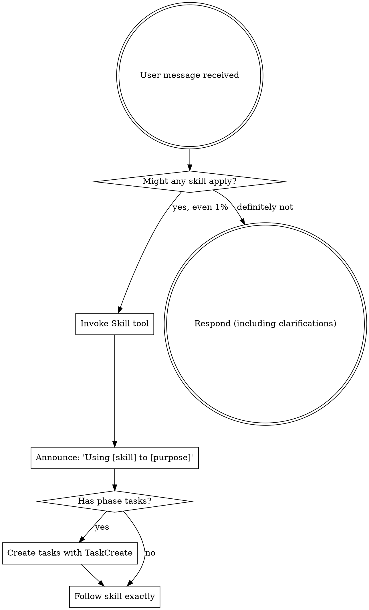

<EXTREMELY-IMPORTANT>
If you think there is even a 1% chance a skill might apply to what you are doing, you ABSOLUTELY MUST invoke the skill.

IF A SKILL APPLIES TO YOUR TASK, YOU DO NOT HAVE A CHOICE. YOU MUST USE IT.

This is not negotiable. This is not optional. You cannot rationalize your way out of this.
</EXTREMELY-IMPORTANT>

## How to Access Skills

**In Claude Code:** Use the `Skill` tool. When you invoke a skill, its content is loaded and presented to you—follow it directly. Never use the Read tool on skill files.

**In other environments:** Check your platform's documentation for how skills are loaded.

# Using Skills

## The Rule

**Invoke relevant or requested skills BEFORE any response or action.** Even a 1% chance a skill might apply means that you should invoke the skill to check. If an invoked skill turns out to be wrong for the situation, you don't need to use it.



## Red Flags

These thoughts mean STOP—you're rationalizing:

| Thought | Reality |
|---------|---------|
| "This is just a simple question" | Questions are tasks. Check for skills. |
| "I need more context first" | Skill check comes BEFORE clarifying questions. |
| "Let me explore the codebase first" | Skills tell you HOW to explore. Check first. |
| "I can check git/files quickly" | Files lack conversation context. Check for skills. |
| "Let me gather information first" | Skills tell you HOW to gather information. |
| "This doesn't need a formal skill" | If a skill exists, use it. |
| "I remember this skill" | Skills evolve. Read current version. |
| "This doesn't count as a task" | Action = task. Check for skills. |
| "The skill is overkill" | Simple things become complex. Use it. |
| "I'll just do this one thing first" | Check BEFORE doing anything. |
| "This feels productive" | Undisciplined action wastes time. Skills prevent this. |
| "I know what that means" | Knowing the concept ≠ using the skill. Invoke it. |

## Skill Priority

When multiple skills could apply, use this order:

1. **Process skills first** (brainstorming, debugging) - these determine HOW to approach the task
2. **Implementation skills second** (frontend-design, mcp-builder) - these guide execution

"Let's build X" → brainstorming first, then implementation skills.
"Fix this bug" → debugging first, then domain-specific skills.

## Skill Types

**Rigid** (TDD, debugging): Follow exactly. Don't adapt away discipline.

**Flexible** (patterns): Adapt principles to context.

The skill itself tells you which.

## User Instructions

Instructions say WHAT, not HOW. "Add X" or "Fix Y" doesn't mean skip workflows.

## Native Task Integration

Many skills use Claude Code's native task tools (TaskCreate, TaskUpdate, TaskList) to enforce quality gates and track progress.

**Pattern:** Skills with multi-phase processes create sequential, blocked tasks:

```
TaskCreate: "Phase 1: [Description]"
  description: "[Acceptance criteria]"
  activeForm: "[Present continuous action]"
  # Returns task ID (e.g., "1") - capture this for dependencies

TaskCreate: "Phase 2: [Description]"
  addBlockedBy: ["1"]  # Use actual ID returned from Phase 1
```

**Note:** TaskCreate returns a task ID in its response. Capture this ID to use in `addBlockedBy` for dependent tasks. The `[phase-1-id]` placeholders in skill documentation represent where you insert the actual returned ID.

**Why this matters:**
- **Visibility:** TaskList shows where you are in the process
- **Enforcement:** Blocked tasks cannot be marked in_progress (skipping is visible)
- **Evidence:** Task descriptions capture what was verified
- **No rationalization:** Dependencies are explicit, not suggestions

**Skills using this pattern:**
- `systematic-debugging` - 4 phase tasks (Root Cause → Pattern → Hypothesis → Implementation)
- `writing-skills` - RED/GREEN/REFACTOR tasks
- `rule-of-five` - 5 sequential pass tasks
- `receiving-code-review` - READ → UNDERSTAND → VERIFY → EVALUATE → IMPLEMENT
- `verification-before-completion` - Verification evidence task
- `writing-plans` - 7 tasks (draft + checklist + 5 rule-of-five passes)
- `finishing-a-development-branch` - Test verification + options + execute + cleanup
- `plan2beads` - 5 conversion phase tasks
- `executing-plans` - Batch checkpoint + feedback tasks
- `subagent-driven-development` - Wave tracking + file conflict verification
- `test-driven-development` - RED/GREEN/REFACTOR per feature
- `using-git-worktrees` - 6 setup verification tasks

**When invoking these skills:** Tasks are created automatically. Follow the skill's instructions for when to mark tasks complete.
