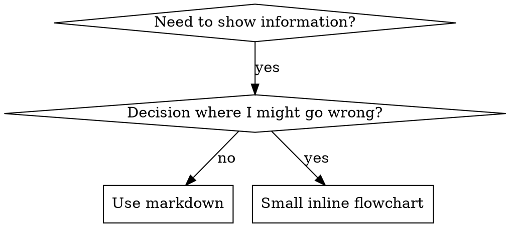

# Description Writing & Discovery Optimization

## The Critical Discovery: Description = Triggering Conditions ONLY

Testing revealed that when a description summarizes the skill's workflow, Claude may follow the description instead of reading the full skill content. A description saying "code review between tasks" caused Claude to do ONE review, even though the skill's flowchart clearly showed TWO reviews (spec compliance then code quality).

When the description was changed to just "Use when executing implementation plans with independent tasks" (no workflow summary), Claude correctly read the flowchart and followed the two-stage review process.

**The trap:** Descriptions that summarize workflow create a shortcut Claude will take. The skill body becomes documentation Claude skips.

## Description Format

- Start with "Use when..." — focuses on triggering conditions
- Third person (injected into system prompt)
- ≤300 characters recommended (≤500 max)
- Specific triggers, symptoms, and contexts
- **NEVER summarize the skill's process or workflow**

```yaml
# BAD: Summarizes workflow - Claude may follow this instead of reading skill
description: Use when executing plans - dispatches subagent per task with code review between tasks

# BAD: Too much process detail
description: Use for TDD - write test first, watch it fail, write minimal code, refactor

# BAD: Too abstract, vague
description: For async testing

# BAD: First person
description: I can help you with async tests when they're flaky

# BAD: Technology-specific but skill isn't
description: Use when tests use setTimeout/sleep and are flaky

# GOOD: Just triggering conditions
description: Use when executing implementation plans with independent tasks in the current session

# GOOD: Triggering conditions only
description: Use when implementing any feature or bugfix, before writing implementation code

# GOOD: Problem-focused, no workflow
description: Use when tests have race conditions, timing dependencies, or pass/fail inconsistently

# GOOD: Technology-specific skill with explicit trigger
description: Use when using React Router and handling authentication redirects
```

## Keyword Coverage

Use words Claude would search for:
- **Error messages:** "Hook timed out", "ENOTEMPTY", "race condition"
- **Symptoms:** "flaky", "hanging", "zombie", "pollution"
- **Synonyms:** "timeout/hang/freeze", "cleanup/teardown/afterEach"
- **Tools:** Actual commands, library names, file types

## Naming Conventions

**Use active voice, verb-first:**
- `creating-skills` not `skill-creation`
- `condition-based-waiting` not `async-test-helpers`
- `flatten-with-flags` > `data-structure-refactoring`
- `root-cause-tracing` > `debugging-techniques`

**Gerunds (-ing) work well for processes:**
- `creating-skills`, `testing-skills`, `debugging-with-logs`

**Letters, numbers, and hyphens only** — no parentheses or special characters.

## Token Efficiency

**Problem:** Getting-started and frequently-referenced skills load into EVERY conversation. Every token counts.

**Target word counts:**
- Getting-started workflows: <150 words each
- Frequently-loaded skills: <200 words total
- Other skills: <500 words (still be concise)

**Techniques:**

Move details to tool help:
```bash
# BAD: Document all flags in SKILL.md
search-conversations supports --text, --both, --after DATE, --before DATE, --limit N

# GOOD: Reference --help
search-conversations supports multiple modes and filters. Run --help for details.
```

Use cross-references:
```markdown
# BAD: Repeat workflow details (20 lines)
When searching, dispatch subagent with template...

# GOOD: Reference other skill
Always use subagents (50-100x context savings). REQUIRED: Use [other-skill-name] for workflow.
```

Compress examples:
```markdown
# BAD: Verbose (42 words)
your human partner: "How did we handle authentication errors in React Router before?"
You: I'll search past conversations for React Router authentication patterns.

# GOOD: Minimal (20 words)
Partner: "How did we handle auth errors in React Router?"
You: Searching...
[Dispatch subagent → synthesis]
```

**Verification:**
```bash
wc -w skills/path/SKILL.md
npx claude-skills-cli validate <skill> --lenient
```

## Cross-Referencing Other Skills

Use skill name only, with explicit requirement markers:
- **Good:** `**REQUIRED SUB-SKILL:** Use superpowers-bd:test-driven-development`
- **Good:** `**REQUIRED BACKGROUND:** You MUST understand superpowers-bd:systematic-debugging`
- **Bad:** `See skills/testing/test-driven-development` (unclear if required)
- **Bad:** `@skills/testing/test-driven-development/SKILL.md` (force-loads, burns context)

**Why no @ links:** `@` syntax force-loads files immediately, consuming 200k+ context before you need them.

## Flowchart Usage



**Use flowcharts ONLY for:**
- Non-obvious decision points
- Process loops where you might stop too early
- "When to use A vs B" decisions

**Never use flowcharts for:**
- Reference material → Tables, lists
- Code examples → Markdown blocks
- Linear instructions → Numbered lists
- Labels without semantic meaning (step1, helper2)

See `graphviz-conventions.dot` (in this directory) for graphviz style rules.

**Render flowcharts:** Use `render-graphs.js` at skill root:
```bash
./render-graphs.js ../some-skill           # Each diagram separately
./render-graphs.js ../some-skill --combine # All diagrams in one SVG
```

## Code Examples

**One excellent example beats many mediocre ones.**

Choose most relevant language:
- Testing techniques → TypeScript/JavaScript
- System debugging → Shell/Python
- Data processing → Python

**Good example:** Complete, runnable, well-commented (WHY), from real scenario, shows pattern clearly.

**Don't:** Implement in 5+ languages, create fill-in-the-blank templates, write contrived examples.

## Discovery Workflow

How future Claude finds your skill:

1. **Encounters problem** ("tests are flaky")
2. **Finds SKILL** (description matches)
3. **Scans overview** (is this relevant?)
4. **Reads patterns** (quick reference table)
5. **Loads example** (only when implementing)

Optimize for this flow — put searchable terms early and often.
